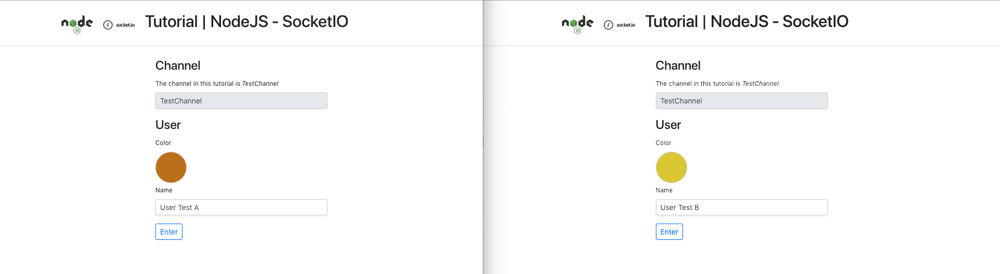
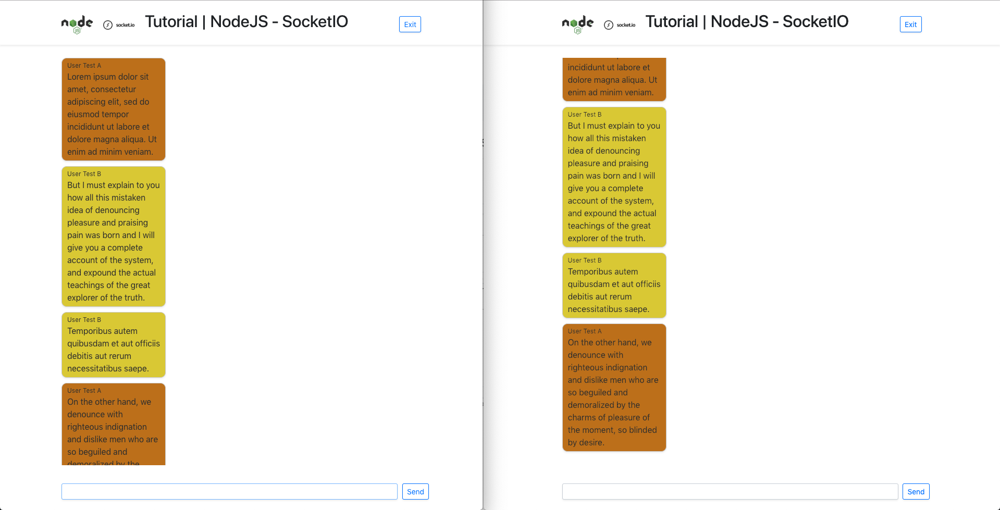

# Tutorial NodeJS and Socket.IO

Create Socket Server with NodeJS and Socket.io.

## Getting Started

These instructions will get you a copy of the project up and running on your local machine for development and testing purposes.

### Prerequisites

- Git.
- Last version of NPM.

### Installing

1. Clone this repository.

2. Enter the directory.

3. Install Javascript dependencies.

```
npm install
npm start
```




### Contact

Linkedin: https://www.linkedin.com/in/josejpr/ \
Twitter: https://twitter.com/JoseJ_PR \
Send email to: jose.perez@sngular.com